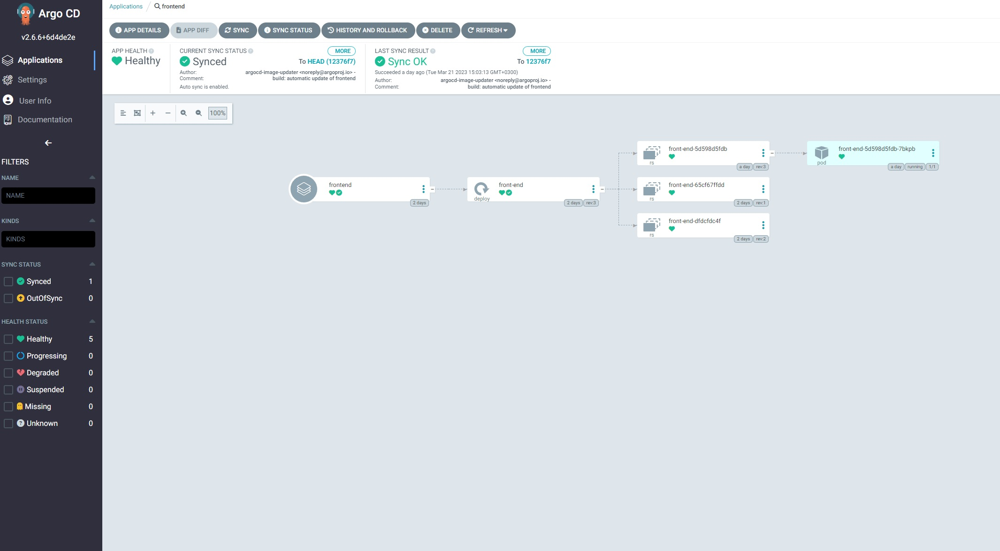
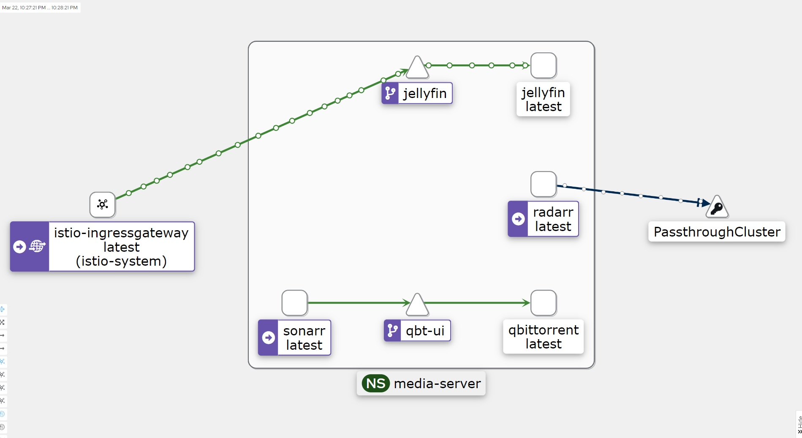

# Project

### Kubernetes установлен на baremetal ( домашние виртуалки ), при помощзь kubeadm, версия 1.26. Сетевой аддон calico, для loadbalancer'ов установлен metallb.

## metallb

### Настройки kube-proxy
    apiVersion: kubeproxy.config.k8s.io/v1alpha1
    kind: KubeProxyConfiguration
    mode: "ipvs"
    ipvs:
      strictARP: true

### Установка metallb и NS
    kubectl create ns metallb-system
    kubectl apply -f https://raw.githubusercontent.com/metallb/metallb/v0.13.9/config/manifests/metallb-native.yaml

### Настройки пула адресов metallb
    apiVersion: metallb.io/v1beta1
    kind: IPAddressPool
    metadata:
      name: pool
      namespace: metallb-system
    spec:
      addresses:
      - 192.168.88.120-192.168.88.150
    ---
    apiVersion: metallb.io/v1beta1
    kind: L2Advertisement
    metadata:
      name: pool
      namespace: metallb-system

## socks shop
 
Ссылка на микросервис

    https://github.com/microservices-demo/microservices-demo
 

установка

    kubectl create namespace sock-shop
    kubectl apply -f deploy/kubernetes/complete-demo.yaml

для mango-DB изменён image на 4.4.6 из-за проблемы с CPU

## Cert-manager

    helm repo add jetstack https://charts.jetstack.io
    helm repo update
    helm install cert-manager jetstack/cert-manager --namespace cert-manager --create-namespace --version v1.11.0 --set installCRDs=true

Файл настроки тестового issuer 

    kind: ClusterIssuer
    metadata:
      name: letsencrypt-staging
    spec:
      acme:
      # The ACME server URL
        server: https://acme-staging-v02.api.letsencrypt.org/directory
      # Email address used for ACME registration
        email: dark_bahamut@mail.ru
      # Name of a secret used to store the ACME account private key
        privateKeySecretRef:
          name: letsencrypt-staging
        # Enable the HTTP-01 challenge provider
        solvers:
        - http01:
            ingress:
              class:  nginx

Файл настроки prod issuer 

    apiVersion: cert-manager.io/v1
    kind: ClusterIssuer
    metadata:
      name: letsencrypt-prod
    spec:
      acme:
      # The ACME server URL
        server: https://acme-v02.api.letsencrypt.org/directory
      # Email address used for ACME registration
        email: dark_bahamut@mail.ru
      # Name of a secret used to store the ACME account private key
        privateKeySecretRef:
          name: letsencrypt-prod
        # Enable the HTTP-01 challenge provider
        solvers:
        - http01:
            ingress:
              class:  nginx

## Ingress 

    kubectl apply -f https://raw.githubusercontent.com/kubernetes/ingress-nginx/controller-v1.6.4/deploy/static/provider/cloud/deploy.yaml

Настройка ingess с получением сертификата ( прод )

    apiVersion: networking.k8s.io/v1
    kind: Ingress
    metadata:
      name: sock-shop
      namespace: sock-shop
      annotations:
        kubernetes.io/ingress.class: "nginx"
        cert-manager.io/cluster-issuer: "letsencrypt-prod"
    spec:
      ingressClassName: nginx
      tls:
      - hosts:
        - "46.39.244.53.nip.io"
        secretName: sock-shop-tls
      rules:
      - host: "46.39.244.53.nip.io"
        http:
          paths:
            - pathType: Prefix
              path: "/"
              backend:
                service:
                  name: front-end
                  port:
                    number: 80

## Теперь наш магазин доступен по адрессу https://46.39.244.53.nip.io с подтверждённым сертификатом.

# Install argo-cd

    kubectl apply -n argocd -f https://raw.githubusercontent.com/argoproj/argo-cd/stable/manifests/install.yaml

### Заходим на фронт арго, как вам удобно, порт-форвард или делаем ингресс для него.
 
Password for web

    argocd admin initial-password -n argocd

Создаем project и app, предаврительно добавив секрет с доступом к гиту argocd/git-cred

    apiVersion: argoproj.io/v1alpha1
    kind: Application
    metadata:
      annotations:
        argocd-image-updater.argoproj.io/git-branch: main
        argocd-image-updater.argoproj.io/image-list: frontend=omegathelegends/front-end
        argocd-image-updater.argoproj.io/write-back-method: git:secret:argocd/git-cred
      name: frontend
      namespace: argocd
    spec:
      destination:
        namespace: sock-shop
        server: https://kubernetes.default.svc
      project: sock
      source:
        path: argocd/frontend
        repoURL: https://gitlab.com/OmegaTheLegends/deploy.git
        targetRevision: HEAD
      syncPolicy:
        automated:
          prune: true
          selfHeal: true
        retry:
          backoff:
            duration: 5s
            factor: 2
            maxDuration: 5m
          limit: 5
        syncOptions:
        - CreateNamespace=true

## В этом репозитории front-end c ci/cd.
# Repo: https://gitlab.com/OmegaTheLegends/otus/-/blob/main/
## Тут ArgoCD репозиторий.
# Repo: https://gitlab.com/OmegaTheLegends/deploy/-/blob/main/

## В качестве storage class'a развернут NFS провайдер

    https://github.com/kubernetes-sigs/nfs-subdir-external-provisioner

    NAME                   PROVISIONER                                         RECLAIMPOLICY   VOLUMEBINDINGMODE   ALLOWVOLUMEEXPANSION   AGE
    nfs-client (default)   cluster.local/nfs-nfs-subdir-external-provisioner   Delete          Immediate           true                   6d20h

 

    apiVersion: storage.k8s.io/v1
    kind: StorageClass
    metadata:
      annotations:
        meta.helm.sh/release-name: nfs
        meta.helm.sh/release-namespace: kube-system
        storageclass.kubernetes.io/is-default-class: "true"
      creationTimestamp: "2023-03-15T22:27:36Z"
      labels:
        app: nfs-subdir-external-provisioner
        app.kubernetes.io/managed-by: Helm
        chart: nfs-subdir-external-provisioner-4.0.17
        heritage: Helm
        release: nfs
      name: nfs-client
      resourceVersion: "4606"
      uid: 48a05a02-7417-4858-8702-aab90ccdc0a2
    parameters:
      archiveOnDelete: "true"
      pathPattern: ${.PVC.namespace}/${.PVC.name}
    provisioner: cluster.local/nfs-nfs-subdir-external-provisioner
    reclaimPolicy: Delete
    volumeBindingMode: Immediate
    allowVolumeExpansion: true

# GitLab Runner 
## Для ci/cd от gitlab в кластер помешён runner. kaniko 

    curl -sL https://github.com/operator-framework/operator-lifecycle-manager/releases/download/v0.24.0/install.sh | bash -s v0.24.0

    kubectl create -f https://operatorhub.io/install/gitlab-runner-operator.yaml

 

    apiVersion: apps.gitlab.com/v1beta2
    kind: Runner
    metadata:
      annotations:
        kubectl.kubernetes.io/last-applied-configuration: |
          {"apiVersion":"apps.gitlab.com/v1beta2","kind":"Runner","metadata":{"annotations":{},"name":"gitlab-runner","namespace":"argocd"},"spec":{"buildImage":"alpine","gitlabUrl":"https://gitlab.com/","tags":"argo","token":"gitlab-runner-secret"}}
      creationTimestamp: "2023-03-20T15:14:38Z"
      finalizers:
      - finalizer.gitlab.com
      generation: 1
      name: gitlab-runner
      namespace: argocd
      resourceVersion: "1158194"
      uid: 69fccd75-37e3-400a-bd2c-0fb7d54ef5ff
    spec:
      buildImage: alpine
      gitlabUrl: https://gitlab.com/
      tags: argo
      token: gitlab-runner-secret
    status:
      phase: Running
      registration: succeeded

## Для определённого NS ( с медиатекой ) используется istio

    NAMESPACE      NAME       GATEWAYS      HOSTS                        AGE
    istio-system   argocd     ["gateway"]   ["argocd.omega.legends"]     3d4h
    istio-system   jellyfin   ["gateway"]   ["jellyfin.omega.legends"]   3d21h
    istio-system   prowlarr   ["gateway"]   ["prowlarr.omega.legends"]   3d21h
    istio-system   qbt        ["gateway"]   ["qbt.omega.legends"]        3d21h
    istio-system   radarr     ["gateway"]   ["radarr.omega.legends"]     3d21h
    istio-system   sonarr     ["gateway"]   ["sonarr.omega.legends"]     3d21h

 

    apiVersion: networking.istio.io/v1beta1
    kind: Gateway
    metadata:
      annotations:
        kubectl.kubernetes.io/last-applied-configuration: |
          {"apiVersion":"networking.istio.io/v1alpha3","kind":"Gateway","metadata":{"annotations":{},"name":"gateway","namespace":"istio-system"},"spec":{"selector":{"istio":"ingressgateway"},"servers":[{"hosts":["*.omega.legends"],"port":{"name":"http","number":80,"protocol":"HTTP"}}]}}
      creationTimestamp: "2023-03-18T22:01:06Z"
      generation: 6
      name: gateway
      namespace: istio-system
      resourceVersion: "857810"
      uid: 61bf7585-6d03-4b03-83cc-2badfc30ed3e
    spec:
      selector:
        istio: ingressgateway
      servers:
      - hosts:
        - '*.omega.legends'
        port:
          name: http
          number: 80
          protocol: HTTP
 

    apiVersion: networking.istio.io/v1beta1
    kind: VirtualService
    metadata:
      annotations:
        kubectl.kubernetes.io/last-applied-configuration: |
          {"apiVersion":"networking.istio.io/v1alpha3","kind":"VirtualService","metadata":{"annotations":{},"name":"jellyfin","namespace":"istio-system"},"spec":{"gateways":["gateway"],"hosts":["jellyfin.omega.legends"],"http":[{"route":[{"destination":{"host":"jellyfin.media-server.svc.cluster.local","port":{"number":80}}}]}]}}
      creationTimestamp: "2023-03-18T22:01:06Z"
      generation: 1
      name: jellyfin
      namespace: istio-system
      resourceVersion: "830214"
      uid: b7b7de43-1ec1-41bc-9a6b-fa4f21d76b3b
    spec:
      gateways:
      - gateway
      hosts:
      - jellyfin.omega.legends
      http:
      - route:
        - destination:
            host: jellyfin.media-server.svc.cluster.local
            port:
              number: 80

